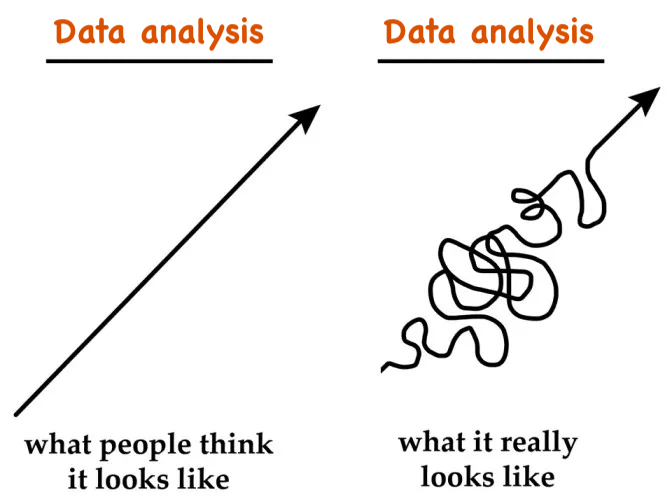
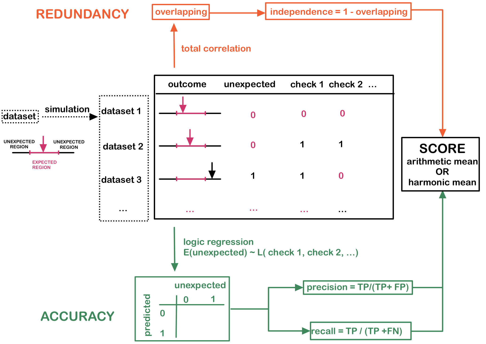
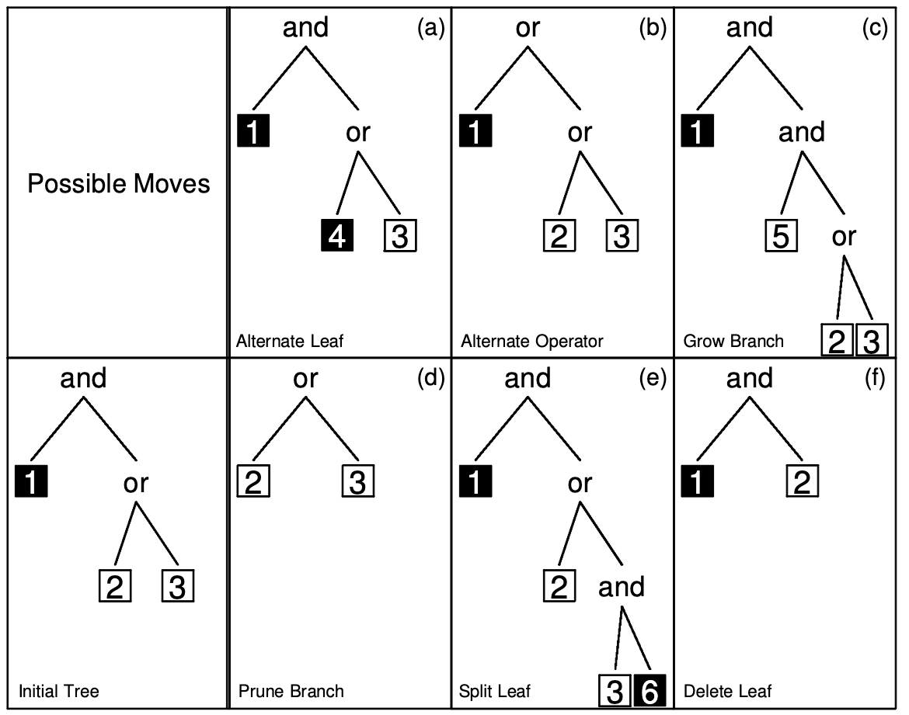
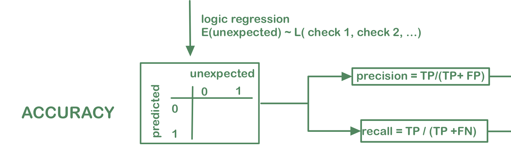
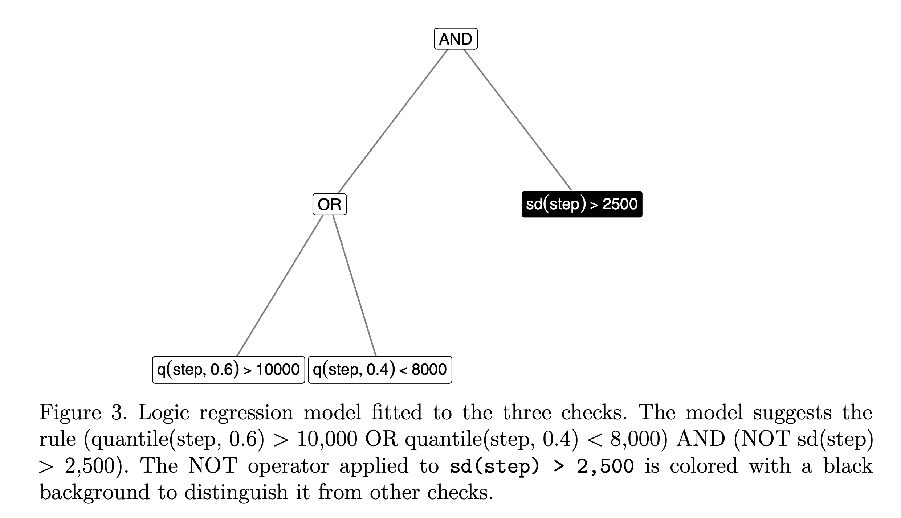
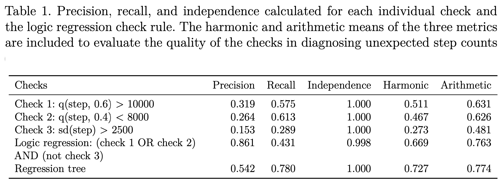
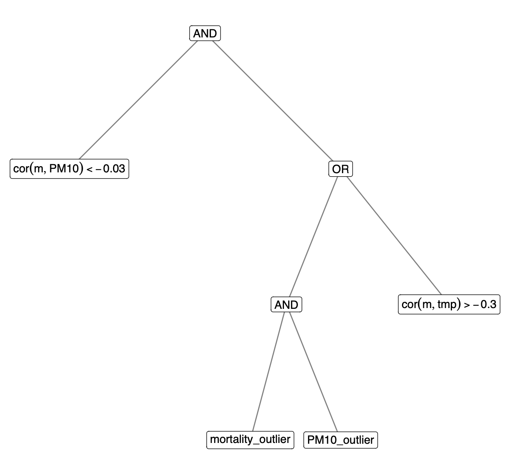
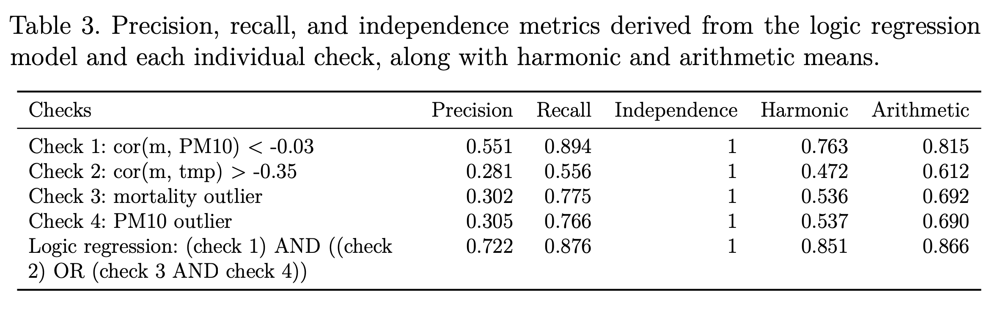
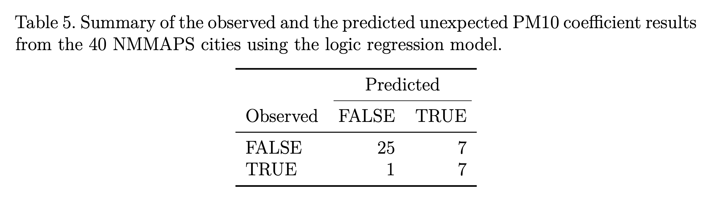

```{r setup}
#| include: false  
library(knitr)
library(tidyverse)
options(htmltools.dir.version = FALSE)
opts_chunk$set(echo = FALSE, warning = FALSE, message = FALSE, 
               error = FALSE, fig.align = "center")
```

## [Unexpected results are everywhere in data analysis]{.r-fit-text}{.smaller}

:::: {.columns}

::: {.column width="50%"}

Example 1: 

Calculate the mean of penguins bill length

```{r echo = TRUE}
library(palmerpenguins)
penguins$bill_length_mm |> 
  mean()
```

<br>

Why are we getting `NA`???

:::

::: {.column width="50%" .fragment}


```{r}
df <- data.frame(
    date = as.Date("2020-01-01") + 0:4,
    value = c(1, 2, NA, 4, 5)
)
```

Example 2: 

Plot the Ozone level in May across time


```{r echo = TRUE}
airquality |> 
  filter(Month == 5) |> 
  ggplot(aes(x = Day, y = Ozone)) + 
  geom_line()
```

What are these gaps???

:::

::::

## [Unexpected results are everywhere in data analysis]{.r-fit-text}{.smaller}


```{r}
pm10 <- read_csv(here::here("data/pm10.csv")) |>    
  filter(!is.na(pm10)) |>    
  mutate(season = as.factor(season))  
```


Example 3: 

A basic linear regression of mortality on PM10 

```{r echo = TRUE}
lm(mortality ~ pm10, data = pm10) |> 
  broom::tidy()
```

<br>

Why is the `pm10` coefficient negative???

--- 

### When presenting an analysis, everything looks perfect and straightforward, but ... {.smaller}


:::: {.columns}

::: {.column width="50%" .fragment}

In every step, analysts need to compare the **expectation and reality**

  - Do they match?
  - Why they are not?
  - Problems with the code? 
  - Problems with the data?
  - ...

:::

::: {.column width="50%"}

{height="300," width="500"}

:::

::::

. . .


## [Setup checks to diagnose unexpected results]{.r-fit-text}

- Some unexpected results are easy to diagnose
  
  - Example 1 & 2: Whether there are any missing values?
  
. . . 

- Some require more domain knowledge: 
  
  - Example 3: Whether temperature confounding has been added into the model?

. . . 

Sometimes, you need multiple checks to safeguard a result -> see the next step count example


## A toy example: step count data

Consider a 30-day step count experiment in a public health setting. Subjects are instructed to walk at least 8,000 steps each day, with an expected average of 9,000 steps, tracked by a step counter app. Given the requirements of the study, we form our expectation as follows: 

. . . 

<br>

<center> **The average step count of a given subject is between [8500, 9500] **</center>

## [Analysis validation checks to validate the data]{.r-fit-text}

Many checks are possible to ensure the average fall into the expected range: 


:::{.incremental}

* Check 1: The 60% quantile of the observed step counts is greater than 10,000  
* Check 2: The 40% quantile of the observed step counts is less than 8,000, and 
* Check 3: The standard deviation of the observed step counts exceeds 2,500.
* ...

:::

## [Analysis validation checks]{.r-fit-text}


:::{.incremental}

* These checks are similar to unit tests in software development, but they are not deterministic -- meaning a check might pass (or fail) even when the result is unexpected (or expected).

* Still, they can be helpful for diagnosing what might be going wrong in the analysis.

* **Can we strike a balance between effectively detecting unexpected outcomes and maintaining a reasonable false positive rate?**

:::

## [A procedure to select the best subset of checks]{.r-fit-text}

<center>{height="400," width="800"}</center>

## [The accuracy branch - the logic regression (not logistic!)]{.r-fit-text}

:::{.incremental}

* Ruczinski et al., 2003 for SNP microarray data

* Construct Boolean expressions $\mathcal{L}(X_1, X_2, \cdots, X_n)$, e.g. $X_1 \text{ AND } (X_2 \text{ OR } X_3)$ from logical operations: 

  <center> AND ($\land$), OR ($\lor$) and NOT ($\neg$) </center>

* The logic regression model:

:::

. . . 

$$E(Y) = \mathcal{L}(X_1, X_2, \cdots, X_n)$$

## [The accuracy branch - the logic regression (not logistic!)]{.r-fit-text}

::: {.columns}

::: {.column width="40%" .fragment}

* Optimize through simulated annealing to minimize the misclassification error

* Six possible moves to grow or prune the tree 


:::

::: {.column width="60%" .fragment}

{height="500" width="700"}

:::

::::


## [The accuracy branch - the logic regression (not logistic!)]{.r-fit-text}

Accuracy measures (precision and recall) as metrics from binary classification errors

<center>{height="400," width="800"}</center>

## The redundancy branch - independency

Total correlation - a generalization of mutual information

$$\sum_{x_1} \sum_{x_2} \cdots \sum_{x_n} p(x_1, x_2, \cdots, x_n) \log \frac{p(x_1, x_2, \cdots, x_n)}{p(x_1)p(x_2) \cdots p(x_n)}$$


* high total correlation: overlapping information among validation checks (bad)
* low total correlation: independent information among validation checks (good)

Independency = 1 - total correlation per observation

## Combine them together

<center>{width="800"}</center>

## The step count example

<center> **Expectation: The average step count of a given subject is between [8500, 9500] **</center>

<center>{width="800"}</center>


## The step count example

<center> **Expectation: The average step count of a given subject is between [8500, 9500] **</center>



# [Application: Association between PM10 and daily mortality]{.r-fit-text} 

## [Association between PM10 and daily mortality]{.r-fit-text}{.smaller}

Study the association between short-term, day-to-day changes in particulate matter air pollution (PM10) and daily mortality counts using the National Morbidity, Mortality, and Air Pollution Study (NMMAPS) data

<br>

. . .

Build the checks on the NYC data and apply them to the other 39 cities in the NMMAPS dataset

<br>

. . .

Model: a simple GLM with Poisson link $$g(\text{mortality}) = \beta_0 + \beta_1 \text{PM10} + \beta_2 \text{temperature}$$

<br>

. . .

Expectation: **The PM10 coefficient $\beta_1$ lies between [0, 0.005]**, based on previous work and the range of effect sizes published in the literature.

## [Factors that could affect the $\beta_1$ estimation]{.r-fit-text}{.smaller}

* Mortality-PM10 correlation less than −0.05 
* Mortality-PM10 correlation less than −0.03 
* Mortality-PM10 correlation greater than 0.03 
* Mortality-PM10 correlation greater than 0.05 

. . . 

* Mortality-temperature correlation greater than −0.3 
* Mortality-temperature correlation greater than −0.35 
* Mortality-temperature correlation greater than −0.4 
* Mortality-temperature correlation greater than −0.45 

. . . 

* Outlier(s) are presented in the variable PM10 
* Outlier(s) are presented in the variable mortality


## [Create replicates of the data]{.r-fit-text}{.smaller background-image="figures/sim-data.png" background-size="45%" background-position="95% 60%"}


::: {.columns}

::: {.column width="55%" .incremental}

* Generate the correlation matrix of PM10, mortality, and temperature in a grid
* Generate the multivariate normal distribution via Gaussian copula
* Transform from the Gaussian CDF to the inverse of CDF to the variable specific distribution based on NYC data  
    * AIC suggests negative binomial for mortality, a beta distribution for PM10 (multiple by 100 to recover the original scale), and Weibull for temperature. 

* Add single outliers to the data for both the mortality and PM10 variable

:::

::: {.column width="30%"}


:::

::::


## The fitted logic regression model {.smaller}

<center>{height="450" width="500"}</center>


## Results



## [Apply the logic rule to the all 40 cities]{.r-fit-text} {.smaller}

<center></center>

:::{.incremental}

* Accuracy rate of 80%: correctly predicts the PM10 coefficient status of 32 cities

* Recall rate of 88%: correctly identifies 7 (Atlanta, Austin, Memphis, Orlando, Salt Lake City, San Antonio, Tampa) out of the 8 unexpected outcomes
    
  * Flagged due to failures in **the mortality-PM10 correlation** and **mortality-temperature correlation** checks

:::

## Discussion {.smaller}

:::{.incremental}

* Visualization methods are also valuable tools for assessing data assumptions and can potentially be formalized as analysis validation checks.

* Systematically generating realistic simulated data is a key component of our approach and is deserving of further consideration.

* Communicating the process of data analysis is a key element to providing transparency, improving reproducibility, and building trust with a range of audiences. The analysis validation checks described here provide a general way to encode the assumptions that an data analyst makes about the data and statistical tools applied to the data.

:::

## `r emo::ji("link")` {background-image="figures/qrcode.svg" background-size="15%" background-position="top right"}

```{r echo = FALSE, eval = FALSE}
library(qrcode)
a <- qr_code("https://sherryzhang-sdss2025.netlify.app/")
generate_svg(a, filename = "figures/qrcode.svg")
```

-   this slide:
    -   : <https://sherryzhang-sdss2025.netlify.app>
    -   :
        <https://github.com/huizezhang-sherry/sdss2025>
-   paper:
    -   Zhang, H. S., Peng, D. R. (2024). Inside Out: Externalizing 
        Assumptions in Data Analysis as Validation Checks. Submitted 
        to the Journal of Data Science: <https://arxiv.org/abs/2501.04296>

